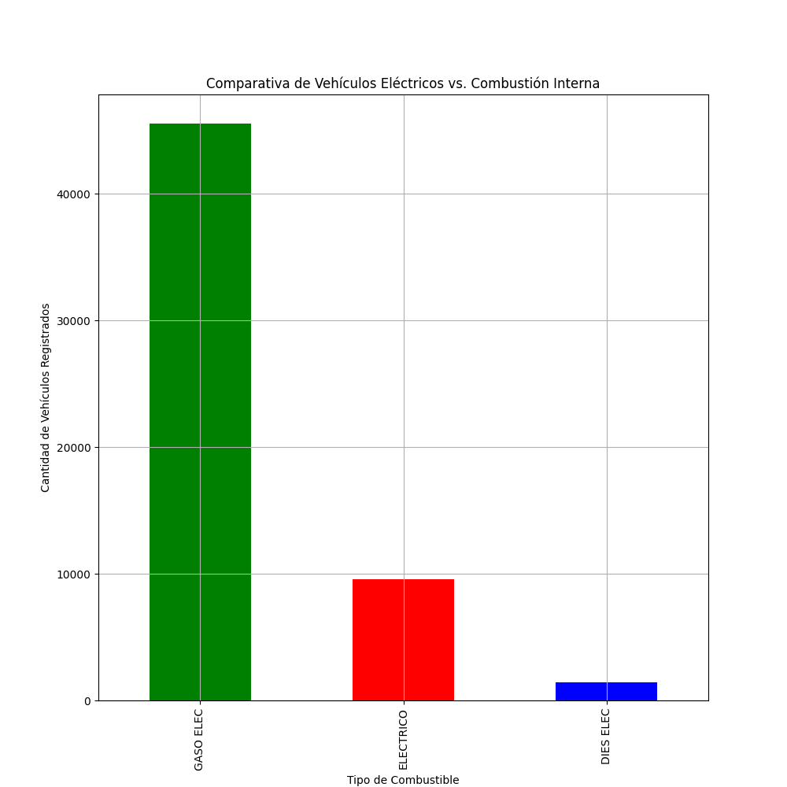
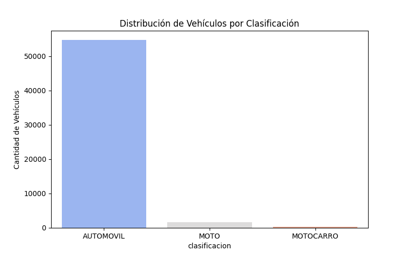
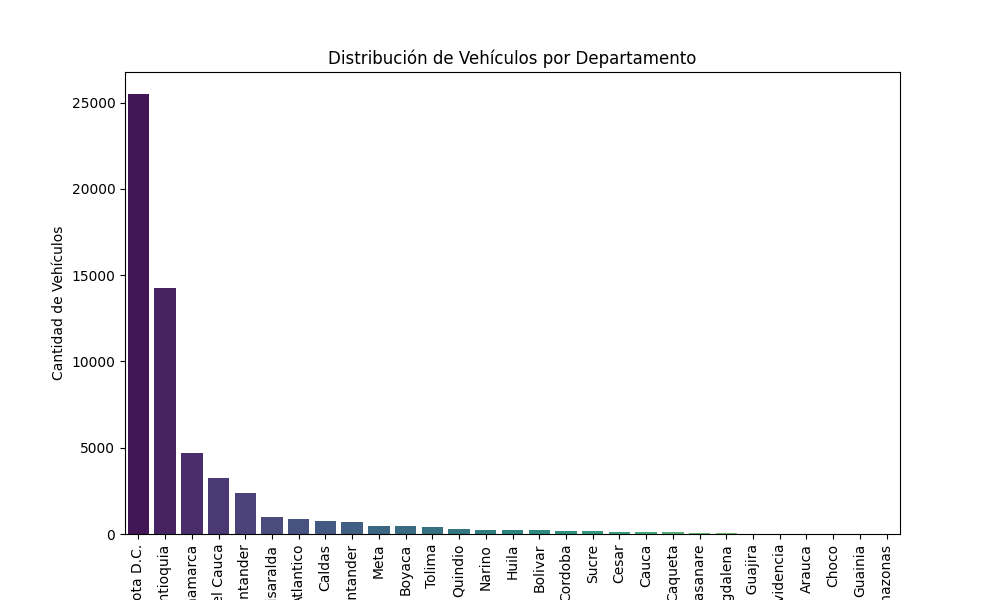
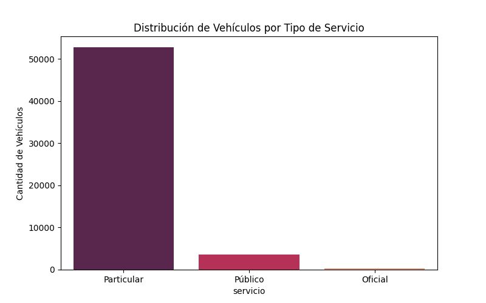

# Conclusiones del análisis
# Análisis de Vehículos Eléctricos e Híbridos en Colombia

Este documento presenta un análisis sobre la adopción de vehículos eléctricos e híbridos en Colombia, basado en datos obtenidos de registros de vehículos en el país.

## Conclusiones

### 1. Comparativa de Vehículos Eléctricos vs. Combustión Interna

- La mayoría de los vehículos registrados son de **combustión interna** (combustible "GASO ELEC").
- La adopción de vehículos **100% eléctricos** es todavía minoritaria.

### 2. Distribución de Vehículos por Clasificación

- El **99%** de los vehículos registrados son **automóviles**, con muy pocos registros de motos y motocarros.

### 4. Distribución de Vehículos por Departamento

- La mayor parte de los vehículos están registrados en **Bogotá D.C.**, seguida de **Antioquia** y **Cundinamarca**.

### 5. Distribución de Vehículos por Tipo de Servicio

- La mayoría de los vehículos registrados son de **uso particular**, mientras que los vehículos públicos y oficiales son significativamente menores.

## Conclusiones Generales
- **Adopción Eléctrica Baja:** A pesar de la tendencia hacia la electrificación, los vehículos **eléctricos** representan una pequeña porción del mercado total.
- **Concentración Urbana:** La adopción de estos vehículos está muy concentrada en grandes ciudades como **Bogotá D.C.**, probablemente debido a que estas ciudades tienen una mejor infraestructura (cargadores, talleres, etc.) para mantener vehículos eléctricos.
- **Preferencia por Híbridos:** Muchos usuarios prefieren **vehículos híbridos** en lugar de eléctricos puros debido a que el país es aún **tradicionalista** en relación con esta nueva tecnología, y no todas las regiones tienen la infraestructura necesaria para operar vehículos eléctricos.
- **Oportunidad en el Sector Público y de Servicios:** Existe una **oportunidad de mercado** en los sectores público y de servicios. Alianzas con empresas como **Gases de Occidente**, que ya usa vehículos eléctricos, podrían facilitar la adopción en estos sectores.

